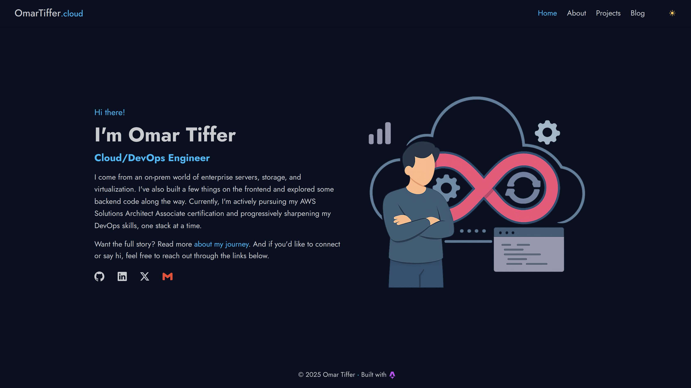

# My portfolio/blog website

[](LICENSE)

This is the source code for my website: [omartiffer.com](https://omartiffer.com). It’s intended to serve as a portfolio of projects I’m working on, and a blog to document my journey and share what I’m learning.



## 🛠️ Tech stack

[](https://www.cloudflare.com/)
[](https://pages.cloudflare.com/)
[](https://astro.build)
[](https://tailwindcss.com/)
[](https://www.typescriptlang.org/)

## ✨ Features

- ⚡ Built with Astro v6 and Tailwind CSS v4
- 📱 Responsive design with light/dark theme
- 🧩 Component-based structure
- 📝 Markdown-powered content pages
- 📓 Notes section with topic-based organization
- 🔀 View Transitions for client-side navigation

## 📂 Project Structure

```text
/
├── notes/                      # Notes content collection (git submodule)
├── public/                     # Static assets (favicon, videos)
├── src/
│   ├── assets/                 # Images and SVG icons
│   ├── components/             # Astro UI components
│   ├── config/                 # Static data (menu, social icons, cert/project images)
│   ├── content/pages/          # Page content as Markdown with YAML frontmatter
│   ├── layouts/                # BaseLayout (single root layout)
│   ├── pages/                  # Astro file-based routing
│   │   └── notes/              # Notes section (index + dynamic routes)
│   ├── scripts/components/     # Client-side TypeScript
│   ├── styles/                 # Global CSS (Tailwind v4 config)
│   └── content.config.ts       # Collection schemas (Zod + glob loader)
├── astro.config.mjs            # Astro project config
├── eslint.config.js            # ESLint flat config
├── wrangler.jsonc              # Cloudflare Pages deployment config
├── package.json                # Dependencies and scripts
└── tsconfig.json               # TypeScript settings
```

## 🚀 Want to try it locally?

### 1. Clone the repo

```bash
git clone --recurse-submodules https://github.com/omartiffer/omartiffer.com.git
```

> The `notes/` directory is a git submodule. If you cloned without `--recurse-submodules`, run:
>
> ```bash
> git submodule update --init --recursive
> ```

### 2. Go into the project directory

```bash
cd omartiffer.com
```

### 3. Install dependencies

```bash
npm install
```

### 4. Start the development server

```bash
npm run dev
```

#### Then open [`http://localhost:4321`](http://localhost:4321) in your browser

## Attributions

- Some HTML components were adapted from [HyperUI](https://www.hyperui.dev/)
- Timeline HTML structure adapted from [Preline UI](https://www.preline.co/)
- Dark/Light themes were generated using [daisyUI](https://daisyui.com/theme-generator)
